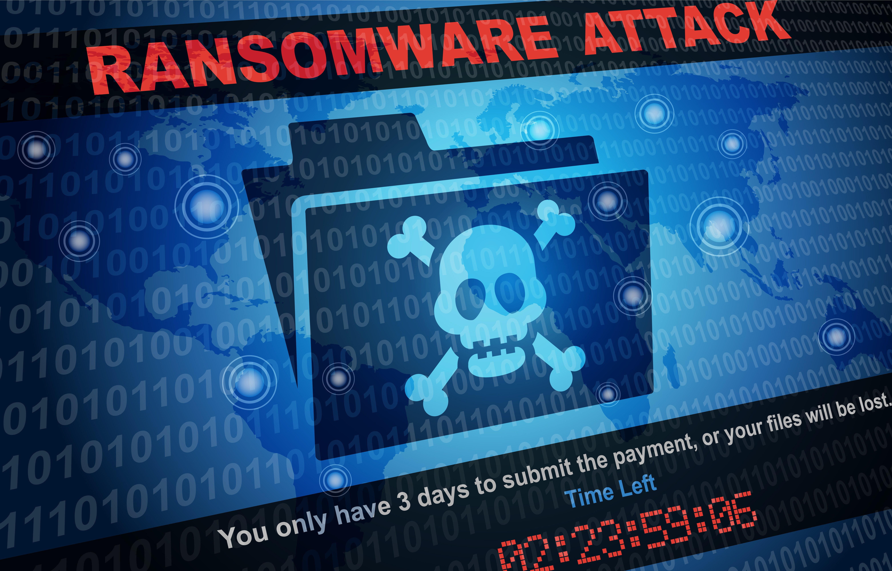

# Ransomware-aanvallen en juridische dilemma’s: mag je losgeld betalen en wat zijn de risico’s?

Ransomware is de afgelopen jaren uitgegroeid tot een van de grootste digitale
bedreigingen voor bedrijven en instellingen. Steeds vaker worden organisaties
wereldwijd het slachtoffer van deze vorm van cybercriminaliteit, waarbij
criminelen bedrijfsdata ‘gijzelen’ en losgeld eisen om de toegang te
herstellen. Maar hoe zit het juridisch: mag je als organisatie losgeld
betalen? En wat als blijkt dat je beveiliging niet op orde was?

## Wat is ransomware en hoe werkt het?

Ransomware is een type malware dat bestanden op een computer of netwerk
versleutelt. Pas na betaling van losgeld – vaak in cryptovaluta zoals Bitcoin
– beloven de criminelen een sleutel te sturen waarmee de bestanden weer
toegankelijk worden. Er zijn grofweg twee soorten aanvallen:

  * Opportunistische aanvallen: Hierbij verspreiden criminelen ransomware op grote schaal, bijvoorbeeld via phishingmails. Iedereen kan slachtoffer worden. Het losgeld is meestal relatief laag, maar het aantal slachtoffers is groot.

  * Gerichte aanvallen: Hierbij kiezen criminelen bewust een organisatie uit waarvan ze verwachten dat die veel geld kan betalen. Ze doen onderzoek naar de organisatie, zoeken naar kwetsbaarheden in de beveiliging en eisen vaak hoge bedragen. Bekende voorbeelden zijn de aanvallen op Universiteit Maastricht en VDL Groep.

Het gevolg is vaak dat bedrijfsprocessen stilvallen: bestellingen kunnen niet
verwerkt worden, de salarisadministratie ligt plat en klanten kunnen geen
gebruik maken van diensten. Dit zorgt niet alleen voor financiële schade, maar
ook voor reputatieschade.

## Mag je als organisatie losgeld betalen?

In Nederland is het betalen van losgeld bij ransomware-aanvallen momenteel
niet expliciet strafbaar gesteld in het Wetboek van Strafrecht. Dit betekent
dat organisaties juridisch gezien wél losgeld mogen betalen, al brengt dit een
complex spanningsveld met zich mee. De situatie is vergelijkbaar met ‘gewone’
gijzelingen, waar het betalen van losgeld door slachtoffers ook niet verboden
is, omdat het slachtoffer onder extreme druk staat en de wetgever hen niet wil
straffen.

### Waarom wordt losgeld betalen niet verboden?

  * Praktische dilemma’s: in crisissituaties, bijvoorbeeld wanneer bedrijf kritische systemen platliggen of gevoelige klantgegevens dreigen te lekken, kan betalen soms de enige manier zijn om bedrijfscontinuïteit te waarborgen.

  * Moeilijke handhaving: een totaalverbod zou kunnen leiden tot omzeiling via buitenlandse vestigingen of tussenpersonen, waardoor het verbod weinig effectief is en een ongelijk speelveld ontstaat.

  * Risico op onderrapportage: strenge sancties op losgeldbetalingen kunnen bedrijven ontmoedigen incidenten te melden, waardoor de overheid minder zicht heeft op cyberdreigingen.[^1]

### Welzijn en ethiek

Hoewel betalen legaal is, adviseert de overheid en veel cybersecurity-experts
af te zien van betaling. Betalen financiert immers criminele netwerken die
niet alleen ransomware ontwikkelen, maar ook andere zware misdrijven zoals
terrorisme en mensenhandel ondersteunen. Bovendien is er geen garantie dat de
data na betaling volledig en correct wordt hersteld; studies tonen aan dat
zo’n 35% van de betalende slachtoffers nooit de beloofde decryptiesleutels
ontvangt.

### Mogelijke juridische risico’s bij betaling

  * Sanctiewetgeving: betalingen aan entiteiten die op sanctielijsten staan (bijvoorbeeld terroristen of gesanctioneerde landen) zijn strafbaar. Omdat het vaak onduidelijk is wie precies achter ransomwaregroepen zit, bestaat het risico dat een betaling onbedoeld een sanctie schendt.

  * Toekomstige regelgeving: in het buitenland, zoals het Verenigd Koninkrijk, zijn al verboden ingesteld voor publieke instellingen om losgeld te betalen. Ook in Nederland onderzoekt de overheid of verzekeraars het vergoeden van losgeld moeten worden verboden, om het verdienmodel van criminelen te ondermijnen.

  * Boetes op grond van NIS2 en AVG: organisaties kunnen boetes krijgen als zij onvoldoende beveiligingsmaatregelen hebben genomen of nalatig zijn geweest in de melding van datalekken, ongeacht of zij losgeld betalen.[^2]

## Aansprakelijkheidsrisico’s bij onvoldoende beveiliging

Naast de vraag of je mag betalen, speelt de vraag of je als organisatie
aansprakelijk bent als blijkt dat je beveiliging niet op orde was.
Organisaties hebben volgens de wet een zorgplicht om persoonsgegevens en
systemen goed te beveiligen. Dit volgt onder andere uit de Algemene
Verordening Gegevensbescherming, waarin staat dat je “passende technische en
organisatorische maatregelen” moet nemen.[^3] Dit betekent dat organisaties
juridisch gezien wél losgeld mogen betalen, al brengt dit een complex
spanningsveld met zich mee. De situatie is vergelijkbaar met ‘gewone’
gijzelingen, waar het betalen van losgeld door slachtoffers ook niet verboden
is, omdat het slachtoffer onder extreme druk staat en de wetgever hen niet wil
straffen.

## Datalekmelding: altijd verplicht

Is er sprake van een ransomware-aanval waarbij persoonsgegevens mogelijk zijn
gelekt? Dan ben je verplicht dit binnen 72 uur te melden bij de Autoriteit
Persoonsgegevens. Dit geldt óók als je losgeld hebt betaald en je data
zogenaamd ‘terug’ hebt gekregen: je weet immers nooit zeker of de criminelen
de data niet alsnog misbruiken.

In 2023 kreeg een zorginstelling een boete van €450.000 omdat zij een
ransomware-incident niet tijdig meldde, ondanks betaling van losgeld. De AP
oordeelde dat de organisatie niet kon garanderen dat gestolen patiëntgegevens
niet waren geëxporteerd.

## Toekomst: strengere regels en hogere boetes

Met de komst van de NIS2-richtlijn (2024) worden de eisen aan cybersecurity
voor bedrijven in vitale sectoren nog strenger. Niet voldoen aan deze eisen
kan leiden tot boetes tot 2% van de jaaromzet. Ook wordt in de EU gesproken
over een verbod op verzekeringsdekking voor losgeldbetalingen, om het
verdienmodel van criminelen te doorbreken.

## Kortom

Het betalen van losgeld bij een ransomware-aanval is in Nederland juridisch
toegestaan, omdat er geen expliciet verbod bestaat. Wel bestaat het risico dat
betaling aan gesanctioneerde partijen strafbaar is volgens de Sanctiewet, en
daarom is voorzichtigheid geboden. Overheidsinstanties raden betaling af
vanwege het financieren van criminele netwerken en het ontbreken van garanties
op herstel.

Daarnaast lopen organisaties grote aansprakelijkheidsrisico’s als blijkt dat
hun beveiliging onvoldoende was. Op grond van de AVG en andere regels geldt
een zorgplicht om passende beveiligingsmaatregelen te treffen. Bij nalatigheid
kunnen hoge boetes en schadeclaims volgen, ongeacht of er losgeld is betaald.

Met de komst van de NIS2-richtlijn worden de eisen aan cybersecurity verder
aangescherpt. Organisaties doen er daarom verstandig aan te investeren in
preventie, incidentmelding en juridisch advies, zodat zij niet alleen voldoen
aan de wet, maar ook beter beschermd zijn tegen ransomware.

Losgeld betalen mag, maar het risico ligt vooral in onvoldoende beveiliging en
nalatigheid. Preventie en compliance zijn essentieel.

[^1]: [ICT magazine ‘moet het betalen van losgeld bij ransomware illegaal zijn?’](https://www.ictmagazine.nl/nieuws/moet-het-betalen-van-losgeld-bij-ransomware-illegaal-zijn/).

[^2]: [Dutch IT Channel ‘de juridische consequenties van ransomwarebetalingen’](https://www.dutchitchannel.nl/news/183397/de-juridische-consequenties-van-ransomwarebetalingen).

[^3]: [Artikel 32 Algemene Verordening Gegevensbescherming](https://eur-lex.europa.eu/legal-content/NL/TXT/HTML/?uri=CELEX:32016R0679).

